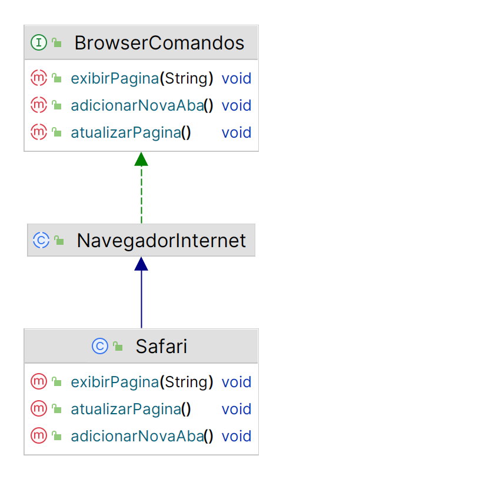

# desafio-poo-dio
Implementacao baseado em alguns papeis de funcionamento do iphone proposto no curso.

## Aparelho Telefonico

A classe **AparelhoTelefonico** é uma classe abstrata contendo a assinatura de dois metodos que todo aparelho telefônico tem em comum *ligar* e *atender* a classe **AparelhoIphone** é a classe mais especifica que herda de AparelhoTelefonico e implementa a interface **MensagemAudio** que assina o metodo *iniciaCorreioVoz* considerando que esse seria um recurso a parte somente para a classe AparelhoIphone.

------

## Reprodutor Musical

Considerando que o ipod é o reprodutor para o aparelho iphone então criado a interface **Reprodutor** que assina os metodos em comun que todo reproduto de midia pode ter inclusive reprodutor de video *tocar*, *selecionar* e *pausar* a classe **ReprodutorMusical** implementa a interface Reprodutor e a classe **Ipod** como sendo uma classe mais especializada herda de ReprodutorMusical.

------

## Navegador de Internet

Levando em conta que o navegador padrão do iphone é o safari, foi criado a classe mais especifica **Safari** que herda a classe abstrata **NavegadorInternet** que por sua vez assina os metodos considerados comuns ao funcionamento de um browser da interface **BrowserComandos** e tem suas implementações concretas na classe Safari.

